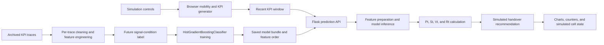
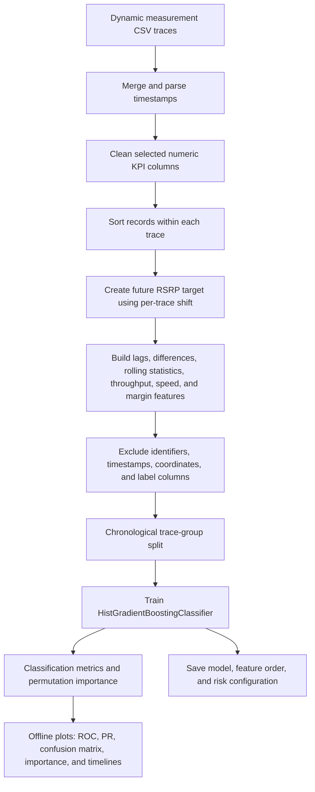
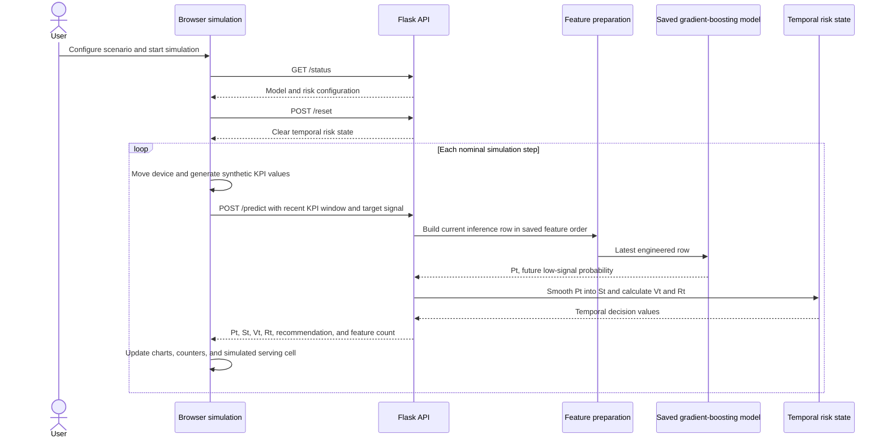

# 5G Mobility Risk Prediction and Handover Decision Support

## Project overview

This academic machine-learning and simulation project explores how recent network measurements can support an earlier handover recommendation than a single current-signal threshold alone. It combines offline model training, a Flask inference API, and an interactive browser simulation that makes the reasoning behind each simulated recommendation visible.

The project is designed as decision-support research. It does not control a live cellular network, trigger real handovers, or claim production deployment. Its value is the end-to-end engineering path from temporal feature construction and probabilistic inference to a transparent, interactive simulation.

## The problem being explored

Traditional signal rules react to the value observed at the current moment. In a moving-device scenario, that can be noisy: a brief dip should not necessarily trigger a cell change, while a steadily worsening trend may need attention before the signal becomes poor.

This project explores two linked questions:

1. Can recent KPI history help estimate a future low-signal condition?
2. How can a raw model probability be transformed into a more stable score for simulated handover experiments?

The result is not a claim that the system guarantees successful handovers. It is a prototype for studying how prediction, smoothing, volatility, and a stronger-target check can work together in a mobility decision workflow.

## End-to-end architecture

The system has an offline training phase and an interactive local inference phase.

### Offline training

The training path reads a committed Excel workbook built from network-measurement traces. It cleans selected numeric fields, keeps measurements separated by trace, creates a future-signal label, engineers temporal features, and splits traces into training and test groups by their starting timestamps. The main executable training path uses scikit-learn's `HistGradientBoostingClassifier`; an earlier exploratory notebook also contains a LogisticRegression experiment.

The saved model bundle records the trained classifier, the ordered feature schema, and temporal-risk parameters. Preserving feature order is important because the runtime API must construct the same input layout that the model saw during training.

### Interactive inference and simulation

The browser application generates synthetic mobility and KPI windows for a simulated device. It sends a recent measurement window to Flask, which prepares an inference row, calls the saved model, calculates the risk values, and returns a recommendation payload.

The frontend owns movement generation, candidate-cell selection, visualisation, and simulated cell changes. The backend owns feature preparation, model inference, and the temporal risk state. This split makes it possible to inspect both the model side and the user-facing decision flow separately.

## Technology stack

### Machine learning and data processing

- **Python:** core language for training, preprocessing, inference, and report utilities.
- **pandas and NumPy:** measurement cleaning, temporal grouping, numerical preparation, and feature calculation.
- **scikit-learn:** HistGradientBoostingClassifier, evaluation utilities, permutation importance, and the earlier LogisticRegression exploration.
- **joblib:** persisted model bundles, feature-order metadata, and temporal-risk configuration.
- **openpyxl:** reading the Excel workbook used by the demonstrated training workflow.

### Application and simulation

- **Flask and Flask-CORS:** local HTTP routes for model status, prediction, diagnostics, and resetting risk state.
- **HTML, CSS, and JavaScript:** one-page simulation interface, controls, event handling, synthetic KPI generation, and canvas rendering.
- **Chart.js:** time-series charts for signal, probability, risk, volatility, and simulated handover events.
- **HTML canvas:** visual device and virtual-cell simulation.

### Analysis and documentation

- **Matplotlib:** saved ROC, precision-recall, confusion-matrix, feature-importance, distribution, and timeline plots.
- **python-docx:** report-generation utilities for project documentation.
- **CSV and Excel:** measurement and training-workbook storage. No implemented database, queue, cloud service, or telecom-controller integration is evidenced in the repository.

## Components and responsibilities

| Component | Responsibility | Important boundary |
| --- | --- | --- |
| Archived measurement traces | Provide historical KPI records for analysis and training | The data is not a live network feed. |
| Training scripts | Clean selected columns, create labels, engineer features, train and evaluate the classifier | Training and app-facing bundle generation are separate paths. |
| Saved model bundle | Stores the trained classifier, input-feature order, and risk settings | Flask must preserve this feature order at inference time. |
| Flask API | Accepts a KPI window, prepares features, runs inference, and returns decision values | It does not operate a real RAN or subscriber device. |
| Browser simulation | Generates synthetic mobility/KPIs, selects candidate cells, displays outputs, and changes simulated state | It is an interactive experiment, not a live mobility controller. |
| Charts and PNG export | Explain the sequence of signals and decision scores during a simulation | Visualisations support analysis; they do not independently prove network improvement. |

## Detailed implementation flows

### Training and evaluation flow

The feature engineering step creates 62 numeric inputs. Trace-level processing is deliberate: it prevents a lag or rolling window from carrying measurements from one recording session into another.

### Browser-to-API decision flow

The browser keeps a bounded recent history for prediction requests. For short windows, the backend returns a warming-up response rather than a normal risk recommendation. In a normal request, the backend uses the latest engineered row to call `predict_proba` and rounds the returned scores for the UI.

## Data, labels, and feature engineering

The demonstrated workbook contains 60 Dynamic traces and 103,545 data rows. It includes signal and mobility-related measurements such as RSRP, RSRQ, SNR, CQI, RSSI, speed, and downlink/uplink bitrate. The project uses historical measurements for model development and synthetic measurements in the browser simulation.

Feature generation happens separately within each trace. This prevents lag values, rolling statistics, and rate-of-change features from crossing one recording session into another. The resulting schema has 62 numeric model inputs, including:

- previous signal values and lags;
- first and second signal differences;
- rolling signal statistics;
- RSRP-margin features relative to the configured threshold;
- throughput-history features; and
- rolling speed information.

The implemented label asks whether RSRP at the third subsequent sample is below `-97 dBm`. It is a sample-based future-signal condition, not a promise that a signal drop will occur within exactly three wall-clock seconds. The data includes irregular sampling intervals, so time-aware label handling is an important area for future evaluation work.

## Model and temporal risk score

The classifier produces `Pt`, the estimated probability of the project's future low-signal condition. The project then turns that probability into an experiment-friendly temporal score:

- **Pt:** the model's predicted probability of the target condition.
- **St:** an exponential moving average of Pt. It smooths sudden one-step changes.
- **Vt:** the mean absolute change across recent Pt values, capped at one. It represents short-term volatility in the model output.
- **Rt:** the composite risk score: `(0.4 * Pt + 0.4 * St) * (1 - Vt)`.

The backend recommends a simulated handover when Rt exceeds the selected threshold and the proposed target signal is stronger than the serving signal. Rt is a decision score, not a calibrated probability. The browser only changes its simulated serving-cell state; no network command is sent outside the application.

## What a simulated run shows

The straight-line mode supports configurable speed, duration, and noise while the random-walk mode can run up to 500 nominal simulation steps. Each step produces a synthetic signal context, updates the recent KPI window, calls the backend, and refreshes the visual state.

The interface can show:

- serving and candidate signal behaviour;
- model probability, smoothed score, volatility, and composite risk over time;
- simulated handover recommendations and cell-state changes;
- counters and summary information for the current run; and
- a full-run PNG export for an experiment record.

The UI's displayed seconds are simulation time. They are not a benchmark of wall-clock model latency or telecom-network timing.

## Implemented capabilities

- Per-trace temporal feature engineering for historical KPI data.
- Gradient-boosting model training and trace-grouped evaluation workflow.
- A saved model bundle with an explicit feature-order contract.
- Flask endpoints for prediction, status, diagnostics, and resetting temporal risk state.
- Straight-line mobility simulation with configurable speed, duration, and noise.
- Random-walk mobility simulation with up to 500 nominal steps.
- Signal, probability, risk, volatility, and handover-event visualisations.
- Full-run PNG export from the browser simulation.
- Offline ROC, precision-recall, confusion-matrix, feature-importance, and timeline plots.

## Engineering decisions and tradeoffs

**Preserving trace boundaries.** Temporal features are built within each trace, which avoids mixing the end of one mobility recording with the beginning of another.

**Separating prediction from policy.** Pt estimates the model target, while St, Vt, Rt, and a target-signal comparison define the experimental decision policy. This makes the effect of smoothing and volatility damping visible instead of hiding every decision behind one probability threshold.

**Matching runtime inputs to training.** The Flask API selects the feature columns in the saved model order and represents unavailable dataset-only values as `NaN`. This maintains structural compatibility but does not prove that synthetic browser inputs exactly match the historical training distribution.

**Keeping the simulation transparent.** The browser shows intermediate values and charts, so the project can be discussed as a technical experiment rather than a black-box recommendation system.

## What the project demonstrates

This project demonstrates practical experience with Python data processing, temporal feature engineering, scikit-learn model packaging, Flask APIs, JavaScript simulation logic, and data visualisation. It also demonstrates a useful machine-learning engineering lesson: a classifier output is not automatically a decision policy. Temporal stability, input compatibility, evaluation design, and user-visible explanations all matter when translating a model into an interactive system.

## Evaluation artifacts and responsible use

The repository includes historical ROC, precision-recall, confusion-matrix, feature-importance, risk-distribution, and timeline plots. These are useful for discussing what was evaluated and how the model output was explored. The training scripts also calculate classification metrics and permutation importance.

The audit did not reproduce the full training or browser integration run, so historical figures are not presented as independently verified performance guarantees. This public source intentionally does not claim an accuracy percentage, a universal latency figure, reduced outages, fewer handovers, or a deployed operational result. Those claims require a corrected, reproducible evaluation protocol and a consistent baseline.

## Scope and responsible interpretation

This is an academic research and simulation prototype. Its historical plots, saved model artifacts, and reports show that the pipeline, inference interface, and simulated workflow were implemented. They should not be treated as independently reproduced production-performance guarantees.

The current implementation does not establish a live-network deployment, measured reduction in outages or handovers, production latency, or a universal accuracy claim. The training data includes multiple network technologies and irregular timestamps, so more rigorous time-aware evaluation is needed before stronger performance claims are made.

## Future improvements

- Correct the future-label and irregular-time handling, then reproduce the evaluation under a documented protocol.
- Use one shared feature-engineering implementation for training and inference.
- Strengthen the traditional-baseline comparison and record reproducible experiment results.
- Isolate simulation state per session and add robust API input validation and automated tests.
- Add production infrastructure only after the offline evaluation and system boundaries are validated.

## Public project link

[5G Handover Stability-Aware ML repository](https://github.com/Mihir-Lakhani/5G-Handover-Stability-Aware-ML)

No deployed public demonstration URL is currently verified.

## Suggested assistant questions

- What problem does the 5G mobility project explore?
- What does the model predict?
- How are time-series features constructed without mixing traces?
- What are Pt, St, Vt, and Rt?
- Why does volatility reduce the composite risk score?
- How is a simulated handover recommendation made?
- Which parts run in Flask and which run in the browser?
- What data and features are used by the model?
- Does this project control a real cellular network?
- What should be improved before production use?
