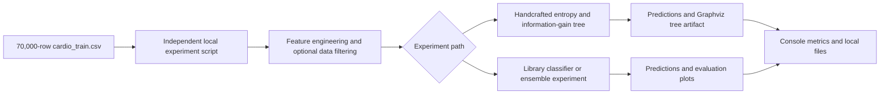
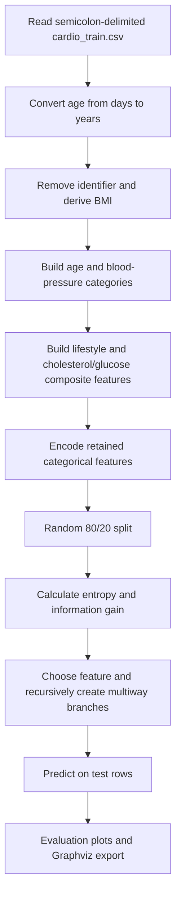
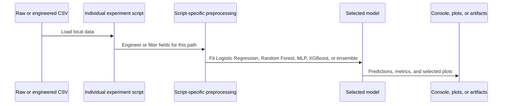

# Cardiovascular Disease Classification Experiments

## Project name and summary

Cardiovascular Disease Classification Experiments is a local Python workspace for studying a binary cardiovascular-disease label with handcrafted and library-based machine-learning models.

The complete project folder contains the raw 70,000-row table, engineered-data experiments, a custom entropy/information-gain decision tree, Logistic Regression, Random Forest, MLP, XGBoost and weighted-probability ensemble scripts. It also contains Graphviz decision-tree artifacts.

This is an exploratory classification project. Future disease-risk prediction, clinical decision support, patient-facing use and deployment are not evidenced in the repository.

## Problem

The project investigates whether demographic, measurement and lifestyle fields can classify the dataset's cardio label. It explores feature engineering, decision-tree construction, outlier handling and comparisons between several model families.

The implementation operates on existing tabular records. It does not collect measurements, estimate time-to-disease, supply treatment advice or connect to a healthcare system.

This is intentionally presented as an early machine-learning project. Its core learning artifact is the handcrafted entropy/information-gain tree: the tree-building logic is implemented directly rather than delegated to a library decision-tree estimator.

## End-to-end architecture

The repository is an experiment workspace, not a single integrated application. Scripts run independently at module level; there is no central runner, browser interface, REST API, database, model server, container, CI workflow, or deployment configuration.

## Correct project folder

The complete project is the folder named Cardio disease prediction.

The separate Cardio_new folder is a derivative fragment. Its only script is byte-identical to Hybrid/Vedansh.py in the complete folder, and its CSV has the same parsed values as the complete folder's engineered CSV. That script expects a missing dataset/heart.csv file. Cardio_new was therefore treated as duplicate evidence, not a second authoritative implementation.

## Data

The main cardio_train.csv contains 70,000 rows and 13 columns, including an identifier and the binary target. The audit confirmed 35,021 class-0 records, 34,979 class-1 records, 70,000 unique identifiers, no missing values and no duplicate full rows.

Fields include age in days, gender, height, weight, systolic and diastolic measurements, cholesterol, glucose, smoking, alcohol use, activity and the cardio label.

The table contains implausible measurement extremes, including non-positive blood-pressure values. The scripts do not apply one consistent clinical data-quality policy.

The engineered new_cardio_train.csv contains 70,000 rows and eight columns: age-BMI interaction, cholesterol-glucose interaction, BMI, smoking, age, activity, blood-pressure/cholesterol interaction and the target. No script in the project generates this file, so its production path is not reproducible from the checked-in code.

Individual identifiers or health records are not reproduced in this public source.

## Implementation

There is no central runner or API. Each Python file executes its experiment at module level.

load_main.py is the largest handcrafted workflow. It:

1. Reads the semicolon-delimited raw dataset.
2. Converts age from days to years and removes the identifier.
3. Derives BMI, age categories, blood-pressure categories, a lifestyle sum and a cholesterol/glucose sum.
4. Retains age category, gender, BMI, blood-pressure category, the two composite scores and the target.
5. Encodes categories and performs a random 80/20 split.
6. Builds a custom multiway ID3-style tree using entropy and information gain.
7. generates a Graphviz tree and evaluates binary predictions.
8. Draws confusion-matrix and approximate ROC/precision-recall plots.

## Detailed implementation flows

### From-scratch decision-tree flow

The handcrafted implementation is the project’s central educational contribution. It shows the mechanics of entropy, information gain, recursive splitting, and tree prediction without using a library decision-tree model. The audit also found a recursive feature-index mismatch, so its tree output should be treated as a learning artifact rather than a reliable clinical model.

### Separate model-experiment flow

These paths are not a controlled benchmark: preprocessing, data filtering, thresholds, and evaluation populations differ between scripts.

Cardio.py implements a separate threshold-based tree and Logistic Regression on five engineered inputs. Its advertised hybrid rule always returns the Logistic Regression prediction, including when the models disagree, so the tree does not influence the hybrid output.

load2.py and load2_load_main.py implement threshold-tree variants using the engineered feature table or interactions derived from the raw table.

The Hybrid folder contains:

- Logistic Regression on unscaled raw numeric features plus BMI.
- Random Forest after clipping/filtering selected numeric fields.
- An MLP with a fixed 0.8 threshold.
- XGBoost with grid search and a fixed 0.35 threshold.
- A weighted ensemble of Logistic Regression, MLP and XGBoost probabilities.
- A CNN/PCA/XGBoost/SHAP experiment that uses a different, missing heart.csv input and cannot run from the inspected checkout.

## Stack

- Python, pandas and NumPy.
- Matplotlib and seaborn.
- scikit-learn for splitting, scaling, Logistic Regression, Random Forest, MLP, grid search, metrics and PCA.
- XGBoost in boosting and ensemble experiments.
- Keras/TensorFlow in neural-network experiments.
- imbalanced-learn/SMOTE in the missing-input CNN/XGBoost experiment.
- SHAP and joblib in that same experiment.
- Graphviz for decision-tree export.
- Local CSV, DOT, PNG and PDF artifacts.

There is no frontend, API, database, model server, container, CI workflow or deployment configuration.

## Components and responsibilities

| Component | Implemented responsibility |
| --- | --- |
| `cardio_train.csv` | Semicolon-delimited raw table with 70,000 records, 13 columns, an identifier, and the binary cardio label. |
| `new_cardio_train.csv` | Eight-column engineered-data derivative used by some experiments; no checked-in script reproduces it. |
| `load_main.py` | Main handcrafted entropy/information-gain multiway-tree workflow and Graphviz export. |
| `Cardio.py` | Separate threshold-tree and Logistic Regression experiment on five engineered inputs. |
| `load2.py` / `load2_load_main.py` | Threshold-tree variants over engineered or interaction-derived inputs. |
| `Hybrid` scripts | Separate Logistic Regression, Random Forest, MLP, XGBoost, and weighted-probability experiments. |
| DOT/PDF/PNG artifacts | Local output representing a generated custom decision tree. |

## Key capabilities

- Profile the supplied cardiovascular table.
- Derive BMI, category and interaction features.
- Implement entropy and information gain without using a library decision tree.
- Train multiple library-based classifiers.
- Combine model probabilities in a weighted ensemble.
- Calculate confusion matrices, classification reports and ROC-AUC in several scripts.
- Export a custom-tree graph through Graphviz.
- Visualize class counts, correlations, distributions and evaluation output.

The scripts are separate experiments rather than one integrated application.

## Challenges and technical decisions

**Interpretable tree construction.** The code implements entropy and information gain directly. Its multiway implementation has a recursive feature-index mismatch, and the graph uses continuous values as branches, producing an enormous artifact.

**Model comparison.** Separate scripts explore several model families. Preprocessing and test populations are not standardized, so their outputs are not a controlled leaderboard.

**Feature engineering.** BMI, measurement categories and composite features reduce the raw schema. Some category logic has defects: extreme blood pressure is captured by the earlier stage-2 branch, so the crisis branch is unreachable.

**Data quality.** Some Random Forest code clips selected columns and removes non-positive values. Other paths use the uncleaned extremes. No evidence establishes which policy is appropriate for clinical use.

## Results and verification

No model file or trustworthy stored metric report is present.

During the audit, source-equivalent deterministic paths were replayed using the available environment:

- Logistic Regression evaluated 14,000 rows and produced accuracy 0.7216, positive-class precision 0.7432, recall 0.6787, F1 0.7095 and ROC-AUC 0.7835. Training emitted a convergence warning.
- Random Forest evaluated 13,995 rows after the script's filtering and produced accuracy 0.7332, precision 0.7582, recall 0.6828, F1 0.7185 and ROC-AUC 0.7987.

These are audit replays, not saved original project results or clinical benchmarks. Neither split is stratified, chronological or externally validated.

The hardcoded three-model comparison chart is not connected to reproducible model outputs and should not be used as evidence.

## Engineering decisions and tradeoffs

### Learning the tree algorithm, not only calling it

Implementing entropy, information gain, recursive branches, and prediction directly makes the decision-tree mechanics visible. It also exposes why production tree implementations need careful handling of feature indexing, unseen values, stopping rules, pruning, and continuous input thresholds.

### Feature engineering simplified mixed measurements

The scripts derive BMI, age and blood-pressure categories, lifestyle/health composites, and interactions. This reduces the raw schema for some experiments, but the rules are inconsistent across scripts and the crisis blood-pressure branch is unreachable because an earlier stage-2 condition captures those values.

### Separate experiments broadened exploration but weakened comparison

Logistic Regression, Random Forest, MLP, XGBoost, and a weighted ensemble explore several model families. They do not share one reproducible pipeline or standardized test population, so their outputs are not a trustworthy leaderboard.

## Limitations

- No README, requirements file, test suite, CI or local Git history is present in the complete folder.
- The bundled virtual environment points to a missing base interpreter.
- Several scripts calculate transformed or scaled data but train on the original dataframe instead.
- Some splits are unseeded, and none of the reviewed main model splits are group-, time- or external-validation designs.
- Category encoding occurs before splitting and is not persisted.
- The custom ID3 recursion can misalign feature names and matrix columns.
- The generated decision-tree PDF is one extremely wide, unreadable page; its DOT graph also reuses leaf identifiers.
- Approximate ROC and precision-recall curves in load_main.py use fixed 0.4/0.6 values derived from hard class labels rather than model probabilities.
- epoch.py calls an undefined function.
- The CNN/PCA/XGBoost/SHAP script lacks its input, TensorFlow dependency and output directory in the inspected checkout; it also applies SMOTE before splitting and uses the test set during neural-network validation.
- The existing public repository contains only an earlier incomplete script and the raw dataset, not the full local workspace.
- No saved estimator, preprocessing pipeline or inference interface exists.
- Dataset licensing is not established by the project files; the referenced Kaggle page reports its license as unknown.
- Medical validity, fairness, calibration, clinical utility and deployment are not evidenced.
- Team size, individual role, development effort and exact completion date are not evidenced.

## Verified links

- [Referenced Kaggle dataset page](https://www.kaggle.com/datasets/sulianova/cardiovascular-disease-dataset).
- [Public partial project repository](https://github.com/Mihir-Lakhani/Cardiovascular-Disease-Risk-Prediction).

The public repository's dataset is byte-identical to the complete folder's raw CSV. Its Python file is an earlier incomplete version and does not match any current local source file.

## Suggested questions

- Which of the two Cardio folders is the complete project?
- What data does the cardiovascular project use?
- What does the handcrafted ID3 workflow implement?
- Which features are engineered?
- Which model families are explored?
- How does the weighted ensemble combine probabilities?
- What was verified during the audit?
- Are the recorded model comparisons reproducible?
- Why is the decision-tree image difficult to use?
- What defects exist in preprocessing and evaluation?
- Is the project clinically validated or deployed?
- What would be required to make the workflow reproducible?
