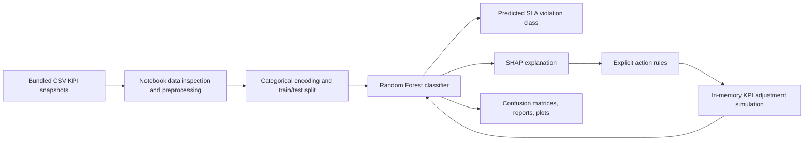
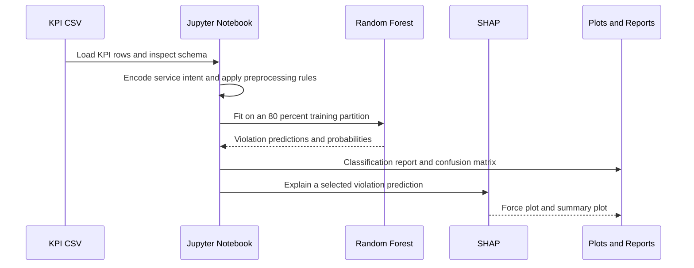
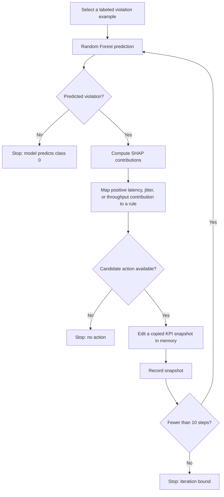

# Closed Loop SLA Violation Simulation

## Project overview

The repository README calls the work "Closed Loop Automation for SLA Violation Prediction." This public case study uses **Closed Loop SLA Violation Simulation** to describe the implemented scope precisely: a Python/Jupyter research prototype that classifies SLA violations from stored network KPI snapshots, explains individual predictions with SHAP, and simulates bounded KPI edits in memory.

It does not operate a telecom network, consume verified live telemetry, send network commands, or independently verify that a service has recovered. The project is best understood as an explainable decision-support and what-if simulation experiment.

## The problem being explored

Network-quality models are more useful when they do more than return a violation label. This project explores a compact loop:

1. classify an SLA-violation risk from a KPI snapshot;
2. inspect the feature contributions behind that prediction;
3. map selected contributions to explicit candidate adjustments; and
4. predict again after applying those adjustments to a simulated copy of the inputs.

The available records are stored KPI snapshots. The repository does not establish a forecast horizon, a verified source of real network measurements, or safe causal actions for a production network.

## End-to-end architecture

The notebook is the entire application surface. There is no browser frontend, REST API, database, message broker, model-serving process, Docker configuration, Kubernetes deployment, or Eclipse Ditto integration in the inspected repository.

## Technology stack

### Data and machine learning

- Python and Jupyter Notebook.
- pandas and NumPy for CSV handling and transformations.
- scikit-learn for categorical encoding, resampling, splitting, Random Forest training, and classification metrics.
- RandomForestClassifier with 100 trees and `random_state=42` in both recorded experiments.

### Explainability and visualization

- SHAP for local force plots and a global summary plot for the violation class.
- Matplotlib and seaborn for confusion matrices, correlations, and simulation-history plots.
- CSV and Git artifacts for local inputs and version history.

## Components and responsibilities

| Component | Implemented responsibility |
| --- | --- |
| KPI CSV files | Store `slice_id`, latency, jitter, throughput, service intent, and the binary SLA-violation label. |
| Notebook inspection cells | Examine labels, missing values, distributions, and correlations. |
| Preprocessing cells | Encode categorical values and apply handwritten latency, throughput, and jitter transformations. |
| Random Forest experiments | Train an initial model and a separately balanced-data model, then render reports and confusion matrices. |
| SHAP cells | Produce local and global feature-contribution views for the classifier. |
| Action rules | Convert selected latency, jitter, and throughput contributions into text or numeric candidate adjustments. |
| Simulation loop | Repeatedly edit an in-memory KPI snapshot, re-predict, and stop at a nonviolation prediction, no action, or ten steps. |

## Detailed implementation flows

### Training and explanation flow

### Simulated correction loop

The loop demonstrates how the same model's output changes after its inputs are modified. It is not an independently validated service-repair workflow.

## Data, labels, and preprocessing

The five CSV files share six columns: `slice_id`, `latency`, `jitter`, `throughput`, `user_service_intent`, and `sla_violation`. The model uses the first five fields as inputs and the binary `sla_violation` field as its target.

The active input contains 1,000 rows: 883 labeled violations and 117 labeled nonviolations. The notebook exports `balanced_final_dataset.csv`; other bundled CSVs are reference or intermediate variants. The current notebook does not train from the file named `high_quality_balanced_sla_dataset.csv`.

For the second experiment, the notebook caps high latency, replaces selected throughput and jitter values using service-specific rules, and samples each label to 1,000 rows with replacement. The standalone `dropna` call does not update the dataframe, so missing latency can remain.

## Implemented capabilities

- Inspect class distribution, missing values, and KPI correlations.
- Train and compare two Random Forest experiments.
- Render confusion matrices and classification reports.
- Generate SHAP local force plots and a global summary plot.
- Translate selected feature contributions into text or numeric action suggestions.
- Explore a manual throughput change.
- Run a bounded, recorded simulation of successive KPI edits.

## Engineering decisions and tradeoffs

### Explainability made the loop inspectable

The project uses SHAP so a violation prediction can be related to individual model inputs before a rule is selected. This makes the candidate-action logic visible, but a SHAP contribution is not evidence that changing that KPI will cause a real service to improve.

### Explicit rules kept the simulation readable

Only latency, jitter, and throughput can trigger the numeric adjustments: decrease latency by 10, decrease jitter by 5, or increase throughput by 10. The rules are easy to inspect, but they omit physical bounds, action validation, rollback, and an independent policy or SLA oracle.

### Balancing exposed a major evaluation risk

Resampling both labels before the 80/20 split produces a balanced training set, but it also allows duplicate rows across train and test partitions. The audit found 327 of 400 test rows exactly matched training rows in the balanced experiment, so its recorded accuracy is not a reliable unseen-data performance claim.

## Verification and responsible interpretation

An audit reproduced both saved confusion matrices from the checked-in data and notebook source, with CSV export intercepted to preserve repository files. It reproduced the committed cleaned intermediate and balanced datasets. The SHAP code, stored HTML payloads, and embedded plots were inspected; a full SHAP execution was not repeated in the inspected runtimes.

The saved correction loop eventually predicts class 0, but reaches negative jitter. That is useful evidence of an incomplete simulation boundary, not evidence of a validated SLA repair. The project should be presented as a research prototype for classification, explainability, and bounded what-if analysis.

## Limitations and future improvements

- Split data before fitting any preprocessing or resampling, and prevent duplicate or related KPI snapshots from crossing partitions.
- Define an explicit prediction-time data contract and validate all input ranges.
- Add realistic bounds, independent outcome checks, rollback, and safe action validation to any future control workflow.
- Persist model artifacts, package dependencies, and add automated tests/CI.
- Validate against documented, time-aware, independently collected network data before making any operational claim.

## Verified links

A public source repository and live demo are not evidenced in the inspected repository. The checkout has no configured remote, so no project URL is inferred from folder names or unrelated links.

Evidence snapshot: Git revision `7cfa4d3cafdb685ecf76d439c23e028ad843ec51`.

## Suggested assistant questions

- What does the closed loop actually do after a violation prediction?
- Which KPIs are used by the Random Forest model?
- How does SHAP connect a model prediction to an action suggestion?
- What stops the simulation loop?
- Why should the balanced-experiment accuracy not be treated as deployment performance?
- Does this project control a live telecom network?
- What would need to change before a real-world decision-support deployment?
