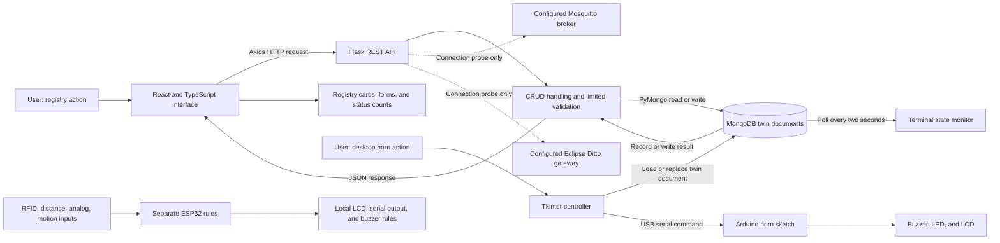
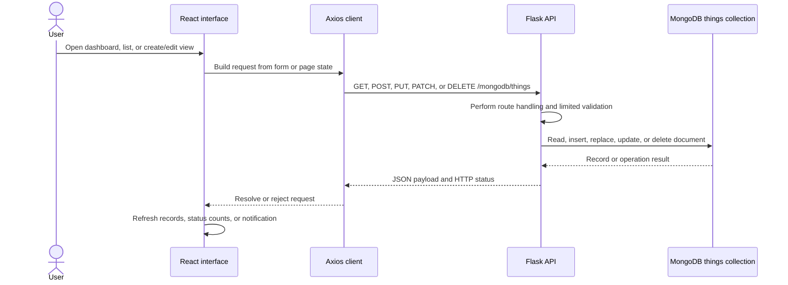
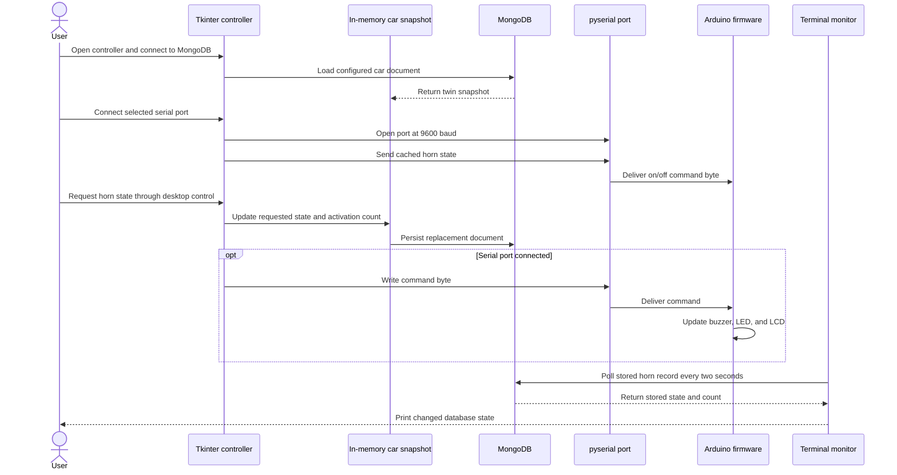
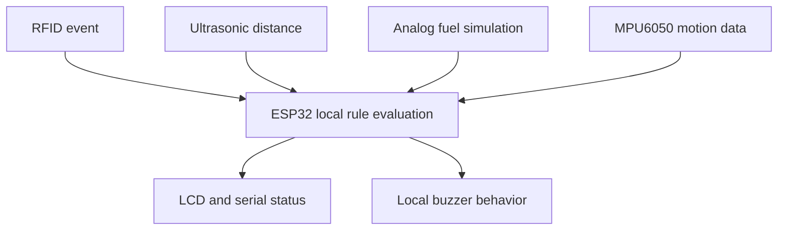

# Fleet Smart Vehicle Digital Twin Prototype

## Project overview

This project explores the foundations of a vehicle digital twin: representing a
vehicle as a software record, managing that record through a web interface, and
connecting a requested feature state to a simple physical-control demonstration.
The implemented prototype combines a React and TypeScript interface, a Flask
REST API, MongoDB document storage, and a separate Python desktop controller
that can send serial commands to an Arduino horn circuit.

It is best understood as a learning and integration prototype rather than an
operational fleet-management platform. The repository demonstrates a working
twin-registry path and a separate local hardware-control path. It does not
establish a deployed fleet, continuous telemetry, browser-to-device control,
predictive maintenance, or production-scale reliability.

## The problem being explored

A useful digital-twin prototype needs more than a screen that displays vehicle
metadata. It needs a persistent software representation, an interface to
create and update that representation, and a clear boundary between requested
software state and a physical device action.

This project explores three practical questions:

1. How can vehicle identity, status, metadata, and feature state be stored as
   a manageable twin document?
2. How can a browser interface expose record-management workflows without
   requiring direct database access?
3. What changes when a stored feature state is connected to a local hardware
   command, and how should the software account for synchronization?

The horn experiment is especially useful because it makes the last question
visible. A database write and a serial command are separate operations, so a
requested state is not automatically proof that the hardware changed state.

## End-to-end architecture

The project contains several independent application paths around a shared
MongoDB document store. The main browser path uses Flask as its API boundary.
The desktop controller and terminal monitor access MongoDB separately. Serial
control is implemented only in the desktop application.

Solid arrows represent implemented code paths. The dashed connections to
Mosquitto and Eclipse Ditto are diagnostics or retained configuration, not an
implemented telemetry or twin-management data path. The ESP32 sketch operates
locally and does not have an executable bridge into the Flask, MongoDB, or
browser workflow.

## Technology stack

### Web application

- **React 18 and TypeScript 4.9:** application structure, typed interfaces,
  routing, record screens, and user interactions.
- **Material UI 5 and Emotion:** interface components and theme styling.
- **React Router 6:** navigation between dashboard, record listing, and create
  views.
- **Axios and notistack:** HTTP calls and UI feedback.
- **Create React App/react-scripts:** development and frontend build tooling.

### API and persistence

- **Python and Flask 3.1:** JSON routes and service entry point.
- **Flask-CORS:** browser access to the API during local development.
- **PyMongo 4.15 and MongoDB 7.0:** direct storage and retrieval of twin
  documents in the digitaltwindb.things collection.
- **Requests and Paho MQTT:** connection-probe utilities. They do not form a
  complete MQTT telemetry pipeline.

### Desktop control and embedded experimentation

- **Tkinter:** local controller interface for the horn demonstration.
- **pyserial:** serial-port connection and on/off command writes.
- **Arduino-style C++:** horn-controller firmware for buzzer, LED, and LCD
  output.
- **ESP32 libraries:** local RFID, ultrasonic-distance, analog, and MPU6050
  motion-sensor experimentation in a separate sketch.

### Packaging and retained platform exploration

- **Docker Compose:** declared MongoDB, Mosquitto, Ditto gateway, Flask, and
  frontend services for local multi-service setup.
- **Dockerfiles, Node build stage, and Nginx:** backend packaging and static
  frontend hosting configuration.
- **Eclipse Ditto, HOCON, Java/Pekko experiments:** retained gateway and
  bootstrap investigation. The main CRUD API does not use Ditto.

There is no trained machine-learning model in the implemented project. The
repository also does not evidence a completed Kubernetes deployment.

## Components and responsibilities

| Component | Responsibility | Important boundary |
| --- | --- | --- |
| React registry | Creates, lists, filters, edits, and deletes stored twin records | It communicates through Flask rather than directly with MongoDB. |
| Flask API | Exposes JSON CRUD routes and simple connection/status responses | It writes MongoDB directly; it does not route CRUD through Ditto. |
| MongoDB collection | Persists twin documents and requested horn-feature state | It is a document store, not a telemetry history or event stream. |
| Tkinter controller | Loads a car twin, updates requested horn state, and sends serial commands | It connects directly to MongoDB and bypasses the web API. |
| Arduino horn sketch | Interprets serial commands and updates buzzer, LED, and LCD outputs | The desktop controller does not read back an acknowledgement. |
| Terminal monitor | Polls stored horn state and activation count every two seconds | It observes database state, not physical actuator state. |
| ESP32 sketch | Applies local rules to sensor readings and local output | It does not publish into the twin registry. |
| Compose and gateway files | Describe intended local service wiring and platform experiments | Configuration alone is not proof of a running integration. |

## Detailed implementation flows

### Browser-to-API twin-management flow

The API supports listing and creating documents at /mongodb/things, then
retrieving, replacing, patching, or deleting an identified record at
/mongodb/things/<thing_id>. Creation adds timestamps and uses thingId as
the record identity. The implementation creates a unique index for that
identifier. It is a prototype API with limited server-side schema validation.

The distinction between replacement and patching matters. A PUT can replace a
whole document, so a client that omits fields can lose metadata. PATCH uses
MongoDB's $set, but nested objects are replaced at the supplied level instead
of being recursively merged. These are important consistency considerations
for a later production version.

### Desktop-to-hardware horn-control flow

This path demonstrates a real engineering tradeoff: the storage write and
serial command are not one atomic transaction. One available controller action
writes the database first and then attempts serial output; another writes
serial first and then stores the change. If either step fails, the requested
database state and physical state can diverge. The controller also does not
read an Arduino acknowledgement, so a completed serial write does not prove
the horn, LED, or LCD changed as requested.

### Local ESP32 sensor flow

The ESP32 work is a separate embedded demonstration. It evaluates local sensor
inputs and output rules, but the audited repository does not include a
publisher, subscriber, database bridge, or browser update mechanism that joins
this sketch to the rest of the twin system.

## Data model and API surface

The generic web flow stores documents around a thingId, optional policy and
definition fields, attributes, and features. The UI presents identity, asset,
status, descriptive, location, maintenance, operational, and custom metadata
fields. These records are data fields, not evidence of active GPS tracking,
maintenance scheduling, relationship processing, or command-execution services.

The project also contains a car seed document whose metadata and horn state use
deeper nesting than the generic web form expects. This reveals an important
prototype challenge: the web form, seed record, and desktop controller do not
yet share one complete schema contract.

Implemented browser-facing capabilities include:

- list and count stored twin documents;
- create a document with a generated identifier and selected metadata;
- retrieve one document by identifier;
- replace, patch, or delete a document;
- locally search and filter fetched records by status;
- show dashboard counts derived from stored status fields; and
- expose basic connection and service-status information.

The dashboard and connection indicators are not operational monitoring. The
counts are derived from stored records, refresh is page-driven, and a liveness
response does not prove that MongoDB, MQTT, Ditto, or hardware is ready.

## Implemented capabilities

- React views for dashboard, twin listing, creation, editing, filtering, and
  deletion workflows.
- Flask JSON endpoints for twin CRUD and simple service/connection diagnostics.
- MongoDB document persistence with a thingId uniqueness constraint.
- A shared-car desktop demonstration that persists requested horn state and
  writes USB serial commands.
- Arduino firmware that maps serial commands to buzzer, LED, and LCD output.
- A terminal program that polls and displays stored horn state changes.
- A separate ESP32 sensor-and-buzzer rules demonstration.
- Docker Compose declarations for a multi-service local environment.
- Retained Mosquitto and Ditto configuration/diagnostic experiments.

## Engineering decisions and tradeoffs

### Direct MongoDB CRUD over incomplete gateway integration

The current Flask routes access MongoDB directly. Eclipse Ditto configuration,
gateway experiments, and troubleshooting material remain in the repository,
but they are not on the working CRUD path. This simplified the implemented
registry flow, while leaving policy enforcement and a full gateway-backed twin
platform outside the demonstrated scope.

### Making state synchronization visible

The desktop controller intentionally ties a software record to a serial
command. That makes the desired-versus-reported-state problem concrete:
persisting a request is not the same as receiving device confirmation. The
prototype is valuable precisely because it exposes that boundary for a later
acknowledgement, timeout, and reconciliation design.

### Managing flexible documents

MongoDB makes it easy to store varied twin metadata during exploration. The
cost is schema drift: the generic web form and seeded car document do not use
the same nesting everywhere, and replacement writes can discard omitted data.
A shared validation schema and an explicit partial-update contract are the
right next steps before expanding the API.

### Packaging a multi-service local environment

Compose captures the intended dependencies, networking, ports, and persistent
volumes for the frontend, backend, database, broker, and gateway. It is a
useful local-environment artifact, but it does not itself prove deployment
readiness, service health, remote browser addressing, or public exposure.

## What the project demonstrates

The project demonstrates practical full-stack and systems-integration skills:

- building typed React interfaces around real record-management workflows;
- designing Flask routes and MongoDB document operations;
- connecting desktop Python, persistent state, and serial hardware control;
- writing simple embedded command and local sensor logic;
- reasoning about state consistency across UI, database, serial communication,
  and device behavior; and
- documenting the boundary between an implemented prototype and planned
  platform integrations.

It also demonstrates a useful engineering lesson: a digital twin is not just a
stored object. A reliable twin needs well-defined schemas, secure access,
desired and reported state, acknowledgements, synchronization rules, and
observability across the full path.

## Verification and responsible interpretation

The audit ran the repository's existing Python suite, where 13 tests passed,
and a frontend TypeScript check. Most backend tests are mocked, so those checks
do not establish a real MongoDB, broker, Ditto, serial-device, or full browser
integration run.

Additional isolated checks exercised project code with substitute database,
HTTP, and serial objects. They confirmed risks around replacement updates,
inconsistent document shapes, connection indicators, and missing hardware
acknowledgements. The audit did not start a production-like stack or operate a
physical actuator.

Accordingly, this project should not be described as a verified live fleet
platform, a complete Ditto deployment, a Kubernetes deployment, an MQTT
telemetry solution, an AI analytics system, or a bidirectionally synchronized
hardware twin.

## Future improvements

- Define one shared schema for React, Flask, MongoDB, and desktop-controller
  data; enforce immutable identifiers and robust validation.
- Replace whole-document client updates with safe partial updates, versioning,
  or optimistic concurrency control.
- Add authentication, authorization, rate limits, safer error handling, and
  protected database/broker configuration before network exposure.
- Introduce desired and reported hardware state, serial acknowledgements,
  communication watchdogs, timeouts, and reconciliation.
- Build an executable ESP32 or device telemetry bridge before claiming live
  MQTT, browser streaming, or fleet observability.
- Align API documentation and Compose startup scripts with the real runtime,
  then test a clean reproducible deployment.
- Revisit gateway integration only with the required Ditto services, policy
  model, and end-to-end verification in place.

## Public project link

[Fleet Digital Twin Eclipse Ditto repository](https://github.com/Mihir-Lakhani/fleet-digital-twin-eclipse-ditto)

No verified public live demonstration URL is available in the audited
repository.

## Suggested assistant questions

- What problem does the Fleet Smart Vehicle Digital Twin Prototype explore?
- How do React, Flask, and MongoDB work together in the registry?
- Which CRUD operations does the API implement?
- How does the Tkinter controller communicate with the Arduino horn?
- Why is a serial write not proof of physical actuation?
- What does the terminal monitor observe?
- What does the ESP32 sketch do, and what does it not connect to?
- Is Eclipse Ditto used by the implemented CRUD path?
- Is MQTT telemetry ingestion implemented?
- Is Kubernetes deployment evidenced?
- Which schema and synchronization risks remain?
- What should be improved before treating this as a production system?
