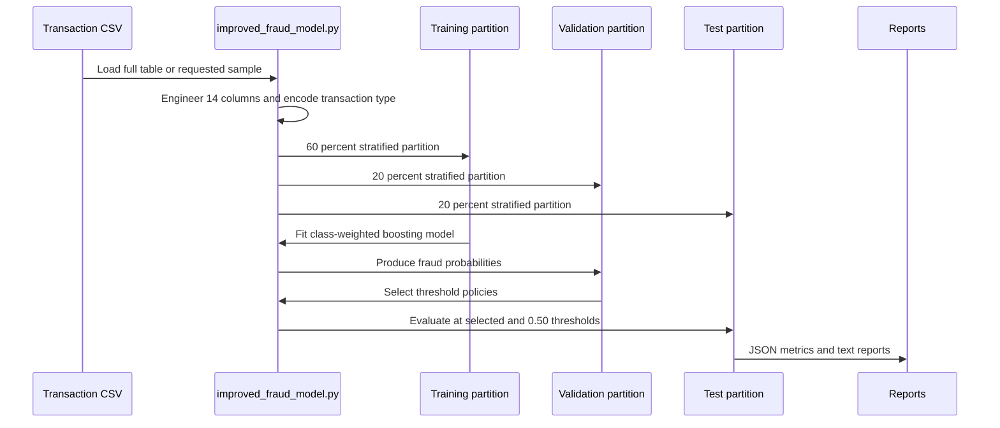
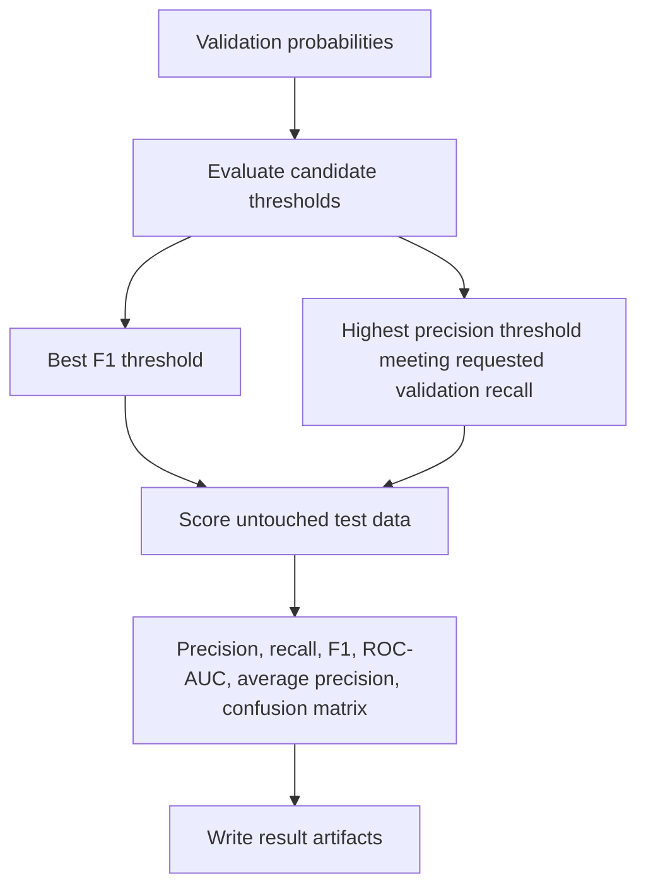

# Fraud Transaction Classification

## Project overview

**Fraud Transaction Classification** is an offline Python machine-learning experiment over a simulated financial-transaction table. Its main script engineers transaction features, trains a class-weighted histogram gradient boosting classifier, chooses decision thresholds on validation data, and produces held-out test reports.

It is not a real-time fraud system. The repository does not implement XGBoost, SHAP explanations, a serving API, a database, or production deployment. The supplied data is explicitly described as simulated, so the experiment does not establish performance on live bank transactions or operational fraud-loss reduction.

## The problem being explored

Fraud labels are extremely rare in the supplied table. A system that predicts every transaction as ordinary can have high overall accuracy while detecting no fraud at all. This project explores a more useful workflow: engineer transaction and balance signals, train with class weighting, choose a decision policy on validation data, and report fraud-class precision, recall, F1, ROC-AUC, average precision, and confusion matrices on an untouched test partition.

## End-to-end architecture

```mermaid
flowchart LR
    A[Simulated transaction CSV] --> B[Load and optional class-proportional sample]
    B --> C[Feature engineering]
    C --> D[Drop account identifiers and one-hot encode transaction type]
    D --> E[Stratified 60/20/20 train, validation, test split]
    E --> F[Class-weighted HistGradientBoostingClassifier]
    F --> G[Validation probability scores]
    G --> H[Choose best-F1 and recall-constrained thresholds]
    H --> I[Score untouched test partition]
    I --> J[JSON metrics and text reports]
```

The implementation is a local command-line experiment. There is no browser interface, REST endpoint, live event stream, transaction store, review queue, or automated alerting workflow.

## Technology stack

### Core experiment

- Python, pandas, and NumPy.
- scikit-learn for stratified splitting, `HistGradientBoostingClassifier`, threshold selection, and classification metrics.
- A class-weighted model with learning rate `0.06`, maximum leaf count `31`, L2 regularization `0.01`, and up to 180 boosting iterations by default.
- Local CSV input plus JSON and text result exports.

### Earlier exploratory work

- Jupyter notebooks, SciPy, Matplotlib, and seaborn for statistics and plots.
- Random Forest, imbalanced-learn/SMOTE, and LightGBM in separate older notebook experiments.

The improved main script does not use SMOTE, LightGBM, XGBoost, or SHAP. The earlier notebook models are separate experiments, not an ensemble or deployed routing system.

## Components and responsibilities

| Component | Implemented responsibility |
| --- | --- |
| `improved_fraud_model.py` | Main configurable training, threshold-selection, and reporting entry point. |
| Transaction CSV | Provides 11 raw columns, including transaction details, balances, a fraud label, and a separate rule-based flag. |
| Feature engineering | Creates 14 derived amount, time, balance-residual, zero-balance, merchant, and ratio features. |
| Model preparation | Removes the target and account identifiers, then one-hot encodes transaction type. |
| Gradient boosting model | Fits a class-weighted classifier and reserves part of training for internal early stopping. |
| Threshold policy | Selects best-F1 and minimum-recall/maximum-precision candidates from validation probabilities. |
| Export layer | Writes structured JSON metrics and human-readable classification reports. |

## Detailed implementation flows

### Training, validation, and test flow

### Decision-threshold flow

The recall constraint applies to validation results only. It is not a guarantee of future fraud recall, and the threshold should not be used operationally without a prediction-time data and monitoring review.

## Data and feature engineering

The main local CSV has 6,362,620 records and 11 raw columns. The audit confirmed 8,213 fraud labels and 6,354,407 nonfraud labels, about 0.1291% fraud, with no missing values. Individual transaction and account identifiers are deliberately not reproduced here.

The script creates 14 engineered columns: a log transaction amount; hour and day offsets derived from `step`; origin/destination balance residuals and their absolute values; four zero-balance indicators; a merchant-destination indicator; and two amount-to-starting-balance ratios with explicit zero-denominator handling. With the supplied categories, the resulting model matrix has 26 columns.

The script removes the two identifier columns, but retains the rule-based flag and uses post-transaction balances; whether those values exist at prediction time would need validation.

## Implemented capabilities

- Load the full table or a configurable class-proportional sample.
- Create derived transaction and balance features.
- Split data into separate fitting, validation, and final-test partitions.
- Train a class-weighted boosting model.
- Compare a fixed 0.50 threshold with validation-selected policies.
- Export machine-readable and human-readable metrics.
- Preserve exploratory notebook work separately from the main experiment.

## Engineering decisions and tradeoffs

### Class weighting instead of optimistic accuracy

The main script addresses the rare fraud class with balanced class weights and reports fraud-focused metrics. That is more informative than rounded overall accuracy, but it does not substitute for time-aware or account-separated validation.

### Validation-selected thresholds preserve the final test set

The script selects a best-F1 threshold and a recall-constrained threshold from validation probabilities before it scores the untouched outer test partition. This gives the main experiment a clearer decision-policy separation than optimizing thresholds on test labels.

### A focused script over mixing experiments

`improved_fraud_model.py` is the coherent implementation path. The repository's Random Forest and LightGBM notebooks use different data preparation and have separate evaluation limitations, so their metrics should not be combined with the improved script's outputs.

## Recorded results and responsible interpretation

The stored report describes a 1,272,524-record test partition containing 1,642 fraud labels. At threshold `0.50`, it records 1,640 true positives, two false negatives, and 49 false positives. At the validation-selected threshold of approximately `0.999`, it records the same true positives and false negatives with zero false positives in that stored run.

The audit verified data counts, split sizes, and arithmetic consistency of the reported accuracy, precision, recall, and F1 values. It also exercised the actual main script on synthetic data while intercepting file writes. The original full-data model, per-record probabilities, ROC-AUC, average precision, and threshold search were not independently replayed because the fitted model and prediction artifacts were not saved.

## Limitations and future improvements

- Validate data availability before transaction completion; post-transaction balances and the rule flag may not be suitable real-time inputs.
- Use time-aware and account-separated validation rather than only random row splits.
- Persist model, preprocessing, schema, feature, and prediction artifacts.
- Add input validation, pinned dependencies, automated tests, and CI.
- Test on documented, legally usable external data and define human-review, monitoring, governance, and rollback processes before any operational use.

## Verified links

[Existing public project listing](https://github.com/Mihir-Lakhani/fraud-detection-xgboost-shap).

This existing portfolio URL is not a verified publication of the inspected source tree: it was not a configured remote in the local checkout, and its XGBoost, SHAP, and performance wording is not adopted by this source. A source-code publication link matching the local implementation and a live demo are not evidenced.

Evidence snapshot: revision `e69eb00dbab9a78d68314a25532c4646dec2c4b8`.

## Suggested assistant questions

- Why is accuracy alone misleading for this fraud dataset?
- Which features does the main script engineer?
- How are train, validation, and test data separated?
- How does the validation-selected threshold work?
- Which model does the implemented main script use?
- Does the project use XGBoost, SHAP, or a real-time API?
- What were the recorded test results, and what did the audit verify?
- What would be required before deployment?
