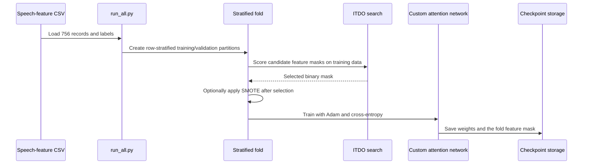
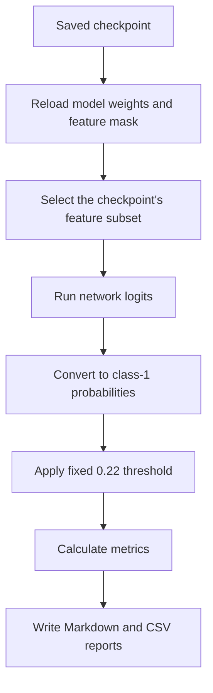

# Parkinson's Speech Feature Classification

## Project overview

The repository describes a Parkinson's disease classifier using AttentionDenseNet and Improved Tasmanian Devil Optimization (ITDO). This public case study uses **Parkinson's Speech Feature Classification** to describe the actual data modality and scope: a local Python/PyTorch research pipeline over precomputed speech-feature records associated with Parkinson's disease and control participants.

The implementation combines a custom fully connected dense network with attention, a two-stage feature-mask search called ITDO, optional SMOTE resampling, saved fold checkpoints, and classification reports. It is a research prototype, not a clinical diagnosis, early-detection, screening, or patient-care system.

## The problem being explored

The dataset has many numeric speech-derived input columns relative to the number of records. The project explores whether a feature-mask search can reduce the input subset before a custom attention-based tabular network is trained, while preserving fold-specific masks and model weights for later evaluation.

The repository consumes a numeric CSV. It does not record speech from a microphone, extract features from raw audio, process EEG, or implement a clinician-facing application.

## End-to-end architecture

The inspected application is a command-line training/evaluation workflow. No Flask route, browser UI, Streamlit screen, diagnostic service, patient database, or deployed clinical integration is implemented.

## Technology stack

### Training and evaluation

- Python and PyTorch.
- pandas and NumPy for table handling.
- scikit-learn for scaling, stratified splitting, logistic-regression scoring during ITDO, and evaluation metrics.
- imbalanced-learn/SMOTE for optional training-partition resampling.
- PyYAML for configuration.
- Local CSV data and PyTorch checkpoint files.

### Supporting analysis

- SciPy, Matplotlib, and seaborn for supplementary filtering and plotting helpers.
- A custom tabular DenseNet-style architecture: initial projection, two dense blocks, a transition, a squeeze/excitation-style attention block, and a two-class output.

It is not image DenseNet-121, even though a depth value appears in configuration. Flask, Streamlit, SHAP, LIME, and torchvision appear in requirements but their application routes, UI, or explainability workflows are not implemented.

## Components and responsibilities

| Component | Implemented responsibility |
| --- | --- |
| `run_all.py` | Runs training and evaluation with the current Python interpreter and can skip either phase. |
| YAML configuration | Supplies dataset, fold, model, optimization, and experiment settings. |
| CSV loader | Reads numeric features, encodes labels where needed, and prepares the table. |
| ITDO | Searches binary feature masks using selection/mutation, bit-level refinement, and logistic-regression cross-validation scoring. |
| Optional SMOTE | Resamples only the selected training features when the dependency is available. |
| AttentionDenseNet-style model | Fits the selected tabular features using Adam and cross-entropy loss. |
| Checkpoints | Store a state dictionary and selected feature mask for each fold. |
| Evaluator | Reloads a checkpoint, applies its mask, thresholds class-1 probabilities at `0.22`, and writes Markdown/CSV metrics. |

## Detailed implementation flows

### Fold training flow

### Evaluation flow

The current evaluator constructs a validation fold but scores a loaded checkpoint on all 756 records, including training records. The flow above describes implemented behavior, not an independent clinical-validation protocol.

## Data, folds, and feature selection

The local CSV contains 756 records and 755 columns: 754 candidate input columns plus a binary class label. It contains three recordings for each of 252 participant identifiers. The UCI catalog identifies repeated sustained-vowel speech recordings and supports the speech modality; the table includes baseline voice, MFCC, and wavelet-related feature groups. [UCI dataset](https://archive.ics.uci.edu/dataset/470/parkinson+s+disease+classification).

The checked-in configuration creates five stratified **row-based** folds. ITDO runs on each training partition to select a different binary mask. Its first stage searches a population through selection and mutation; its second stage refines a mask through single-bit changes. Candidate masks are scored with cross-validated logistic-regression accuracy. ITDO chooses features; Adam updates neural-network weights.

## Implemented capabilities

- Load, encode, and standardize the supplied speech-feature table.
- Create stratified training partitions.
- Search feature subsets through the custom ITDO implementation.
- Apply optional SMOTE after feature selection.
- Train a custom dense attention network with Adam.
- Save and reload fold-specific weights and feature masks.
- Produce classification metrics and Markdown/CSV reports.
- Define a small feature-selection hyperparameter sweep.

Auxiliary filtering, spectral-proxy, statistical, and CSP helpers are not in the default training path. Their presence does not establish an EEG or raw-audio processing workflow.

## Engineering decisions and tradeoffs

### Feature masks were persisted with model weights

Each checkpoint stores the selected mask as well as model weights, so evaluation can reconstruct the input subset used by that fold. The saved artifacts do not include a fitted scaler, feature names, or complete experiment metadata, which limits full reproducibility.

### SMOTE was scoped to training after feature selection

The implementation attempts SMOTE on selected training features after splitting. The dependency is missing from the main requirements file, and the code can continue without resampling if it fails.

### Attention is implemented, but requires careful validation

The attention block averages representations across the batch. The audit confirmed that the same record's probability can vary with different batch companions, although labels did not change in the audited comparisons. That behavior is a reason for targeted architecture and evaluation work, not a clinical claim.

## Verification and responsible interpretation

The audit loaded all five saved checkpoints with restricted weights-only loading and confirmed that they matched the current architecture. It reproduced every numeric metric in the saved classification report, exercised the network/Adam/SMOTE path with a small synthetic training smoke check, and separately exercised the ITDO search.

The recorded `96.96%` accuracy is not independent-test performance. The current evaluator scores all 756 rows, including each checkpoint's training records. The audit also found participant overlap across row-based folds: in fold 4, 145 of 151 validation recordings have another recording from the same participant in training. Scaling is fitted before the split, and the participant identifier is initially retained as a candidate input.

## Limitations and future improvements

- Split by participant before any scaling or feature-selection work.
- Remove participant identifiers from candidate predictors and fit preprocessing only on training data.
- Replace or redesign batch-sensitive attention behavior and add focused unit tests.
- Document/calibrate the decision threshold and evaluate on an untouched participant-held-out cohort.
- Persist fitted scalers, feature names, dependency versions, full configuration, and prediction artifacts.
- Conduct external, prospective, clinical, fairness, and governance validation before any healthcare use.

## Verified links

- [Public source repository](https://github.com/Mihir-Lakhani/parkinsons-attndensenet-itdo)
- [UCI Parkinson's Disease Classification dataset](https://archive.ics.uci.edu/dataset/470/parkinson+s+disease+classification)

The public repository's broader EEG and clinical-performance wording is not adopted by this source. A live application is not evidenced in the inspected repository.

Evidence snapshot: revision `fe9dd39508818bc5412350fdf439725c054f40a9`.

## Suggested assistant questions

- Does this project use speech features, raw audio, or EEG?
- What does ITDO do, and how is it different from Adam?
- What is the architecture of the custom attention network?
- How does training create and save fold-specific models?
- What does the current evaluator actually score?
- Why are the recorded metrics not clinical or independent-test evidence?
- Why does participant overlap matter?
- What improvements would make the research evaluation more reliable?
