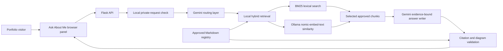
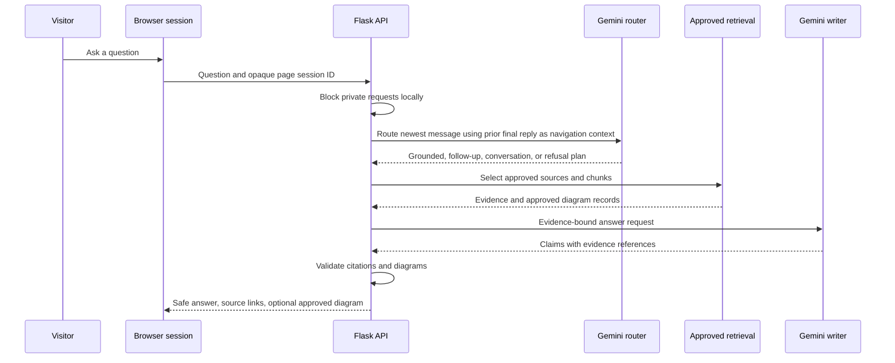

# Source-Cited RAG Assistant

## Project overview

The Source-Cited RAG Assistant is the Ask About Me feature in Mihir Lakhani's public portfolio. It helps visitors explore approved public information about projects, skills, certifications, education, and professional background while attaching the source used for factual portfolio answers.

The project is designed as an evidence-first portfolio assistant rather than an unconstrained chatbot. It retrieves reviewed Markdown sources, asks Gemini to write from selected evidence, validates every returned citation before publishing it, and declines questions that are unsupported or private.

## Problem being addressed

A portfolio often contains many projects, technologies, and research notes that are hard to navigate through a static page alone. A general-purpose chatbot can make this worse by mixing sources, inventing details, or repeating private information.

This project explores a safer alternative: give a visitor a conversational entry point, keep the retrievable corpus limited to an approved public registry, preserve citations, and make unsupported answers fail closed. It also supports approved architecture diagrams without allowing visitor-supplied or model-generated Mermaid code to reach the browser.

## End-to-end architecture

The default retrieval path is local hybrid search. It reads only enabled entries in the reviewed source registry, combines BM25 lexical ranking with locally generated Nomic embeddings, and uses exact NumPy cosine similarity over the small portfolio corpus. Gemini performs routing and answer writing, but it receives only the selected approved evidence for a factual response.

Gemini File Search remains a selectable alternative adapter. It is accepted only when its remote document inventory and content hashes match the approved source registry, so the application does not silently mix old or unregistered public claims into a response.

## Request and memory flow

For each browser page, the backend keeps only an opaque reference to the latest stored Gemini final reply. Router continuation interactions are temporary and deleted after routing. The browser does not store a transcript, prompt, source passages, or API key.

## Evidence and safety controls

- Only enabled files in `knowledge/sources.json` may be retrieved or cited.
- The local index stores source hashes, chunk IDs, heading paths, and approved Mermaid records. The application refuses a missing, stale, malformed, or mismatched index.
- Claims must reference selected local chunks or validated Gemini File Search evidence before the backend returns a citation.
- The local private-information check blocks requests for contact details, credentials, addresses, grades, private notes, and other sensitive personal information before they are sent to Gemini.
- Mermaid is rendered only when extracted verbatim from an approved cited source. The visitor and the answer model cannot inject diagram code into the page.
- Diagnostics record redacted structural data such as retrieval mode, selected source IDs, score bands, duration, and provider-failure category. They intentionally omit raw questions, answers, prompts, evidence passages, and secrets.

## Implemented user experience

- General conversation such as greetings or generic technical explanations can receive a brief non-portfolio reply.
- Factual questions about Mihir or the portfolio route to approved retrieval.
- Multi-turn follow-ups can use the final reply as navigation context while re-retrieving evidence rather than trusting prior generated text as fact.
- Explicit requests for detailed project information use a broader structured response profile with titled, source-backed sections.
- Explicit architecture and flowchart requests can include relevant approved Mermaid diagrams alongside normal citations.

## Current scope and limitations

The assistant is a portfolio-navigation system, not a source of private information or an authority beyond its reviewed public materials. It cannot answer facts absent from the registry, and it should not be treated as a substitute for direct discussion with Mihir.

The local hybrid path requires a current local index and an Ollama service running the configured embedding model. Gemini answer generation remains an external provider dependency, so provider outages, quota limits, or unavailable credentials produce a safe retry response rather than an invented answer.

The current project is prepared for containerized deployment, but this source does not claim a completed production deployment, uptime guarantee, or enterprise-scale monitoring system.

## Suggested assistant questions

- What problem does the Source-Cited RAG Assistant solve?
- How does the RAG assistant keep answers grounded in approved sources?
- Show the architecture diagram for the RAG project.
- How does the assistant remember a follow-up without trusting prior answers as evidence?
- What happens when a visitor asks for private information?
- Why does the local hybrid mode use both BM25 and embeddings?
