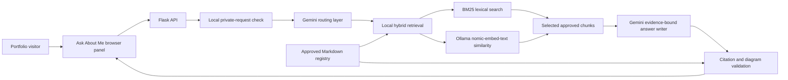
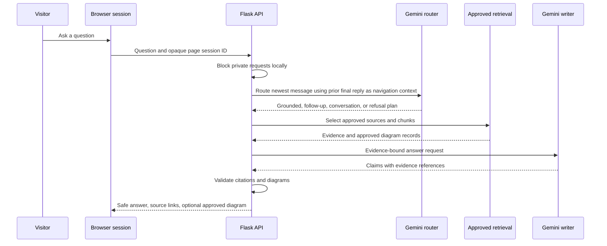

# Public Copy Review Bundle

This is a review-only bundle for public portfolio copy. It is intentionally not
listed in `knowledge/sources.json`, so it is not retrievable or citable by the
portfolio assistant. The canonical public sources remain the individual files
named in each section below.

## Profile Source

Canonical file: `knowledge/public/background.md`

### Current direction

Mihir Lakhani is a B.Tech Computer Science and Engineering student specializing
in Computer Networking at SRM Institute of Science and Technology (SRMIST),
Kattankulathur. He is building toward full-stack AI/ML engineering and AI/ML
engineering roles with practical MLOps knowledge.

His current work combines machine-learning experimentation with usable software
systems: Python services, frontend interfaces, source-backed technical
communication, and project-level evaluation. He is currently learning the
practical side of MLOps: how to deploy, operate, secure, and optimize AI
applications.

### Research internship and network digital twins

From January through June 2025, Mihir worked as an AI/ML Research Intern on a
Network Digital Twin Project under a visiting faculty member at SRMIST. The
research explored network digital twins for 6G-oriented scenarios, SLA-breach
prediction, explainability, and proactive network-control ideas.

That work led to the Closed Loop SLA Violation Simulation, a research prototype
for classifying SLA-violation risk from network KPI snapshots, explaining
predictions with SHAP, and simulating bounded KPI adjustments. Mihir presented
the project and the broader research idea at Nokia Campus Connect in June 2025,
where the work received third place.

During the internship, he spent several months learning digital-twin concepts
and how AI could contribute to them. That learning path led to the Fleet Smart
Vehicle Digital Twin Prototype, where he explored how a browser interface, a
Flask API, persistent twin documents, and local hardware controls can fit into
one system.

### AI and machine-learning journey

Mihir first encountered machine learning through a small college project. He
then built the Cardiovascular Disease Classification Experiments workspace
without using machine-learning libraries for the decision-tree implementation.
Working through entropy, information gain, splits, and predictions directly
made the underlying model behavior more concrete and deepened his interest in
ML systems.

Hands-On Machine Learning with Scikit-Learn, Keras, and TensorFlow by Aurelien
Geron helped him build a practical foundation for later work. His public
portfolio now spans interpretable tabular modeling, healthcare-oriented
experiments, telecom quality-of-service research, 5G mobility simulation,
digital-twin integration, fraud-classification experiments, explainable
automation, and a source-cited RAG assistant.

### Skills and recognition

Across that work, Mihir uses Python, Flask, HTML, CSS, JavaScript, React, Git
and GitHub, data visualization, feature engineering, model evaluation, and
SHAP-based explainability concepts. His systems-oriented tools include MySQL,
PostgreSQL, Docker, Kubernetes, Eclipse Ditto, Jupyter, VS Code, and Notion.

His public recognition includes third place at Nokia Campus Connect 2025 for
the AI research work and first place in a section-level AutoCAD design
competition. Certification details are available in the dedicated public
certifications source.

### Outside technical work

When he has genuine free time outside study and project work, Mihir enjoys
story-driven games. Recent months have been focused mainly on coursework,
research, and building projects.

## Education-Only Source

Canonical file: `knowledge/public/education.md`

This information is approved only for explicit education-focused questions.
It must not be surfaced as part of a broad profile response.

Mihir Lakhani is pursuing a B.Tech in Computer Science and Engineering with a
specialization in Computer Networking at SRM Institute of Science and Technology
(SRMIST), Kattankulathur, Chennai. He began the program in 2023 and expects to
complete it in 2027. His current CGPA is 8.36.

Mihir completed Class 10 through the CBSE curriculum at Maharana Mewar Public
School in Udaipur, Rajasthan.

He completed Class 12 through the CBSE curriculum at St. Paul's School in
Banswara, Rajasthan, in the science stream with Mathematics and Computer
Science, including Python as a subject.

## SUMMARIZE Content

Canonical file: `templates/index.html`

### Intro

Mihir Lakhani is a B.Tech Computer Science and Engineering student specializing
in Computer Networking at SRMIST. He builds full-stack AI/ML systems and is
strengthening practical MLOps skills for deploying, operating, securing, and
optimizing AI applications.

### Metrics

- Education: B.Tech CSE, Computer Networking
- Research: AI/ML Research Intern, Network Digital Twin
- Recognition: 3rd Place, Nokia Campus Connect

### Featured System

**Source-Cited RAG Assistant**

An evidence-first assistant that retrieves approved public sources, validates
citations, renders approved diagrams, and declines unsupported or private
requests.

## RAG Project Card

Canonical files: `templates/index.html` and `static/script.js`

- Status: Source-Grounded
- Title: Source-Cited RAG Assistant
- Copy: An evidence-first portfolio assistant with approved-source retrieval,
  validated citations, safe multi-turn context, and approved architecture
  diagrams.
- Action: Open Ask About Me

## Full Source-Cited RAG Assistant Source

Canonical file: `knowledge/public/projects/source_cited_rag_assistant.md`

# Source-Cited RAG Assistant

## Project overview

The Source-Cited RAG Assistant is the Ask About Me feature in Mihir Lakhani's
public portfolio. It helps visitors explore approved public information about
projects, skills, certifications, education, and professional background while
attaching the source used for factual portfolio answers.

The project is designed as an evidence-first portfolio assistant rather than an
unconstrained chatbot. It retrieves reviewed Markdown sources, asks Gemini to
write from selected evidence, validates every returned citation before
publishing it, and declines questions that are unsupported or private.

## Problem being addressed

A portfolio often contains many projects, technologies, and research notes that
are hard to navigate through a static page alone. A general-purpose chatbot can
make this worse by mixing sources, inventing details, or repeating private
information.

This project explores a safer alternative: give a visitor a conversational
entry point, keep the retrievable corpus limited to an approved public registry,
preserve citations, and make unsupported answers fail closed. It also supports
approved architecture diagrams without allowing visitor-supplied or
model-generated Mermaid code to reach the browser.

## End-to-end architecture

The default retrieval path is local hybrid search. It reads only enabled entries
in the reviewed source registry, combines BM25 lexical ranking with locally
generated Nomic embeddings, and uses exact NumPy cosine similarity over the
small portfolio corpus. Gemini performs routing and answer writing, but it
receives only the selected approved evidence for a factual response.

Gemini File Search remains a selectable alternative adapter. It is accepted only
when its remote document inventory and content hashes match the approved source
registry, so the application does not silently mix old or unregistered public
claims into a response.

## Request and memory flow

For each browser page, the backend keeps only an opaque reference to the latest
stored Gemini final reply. Router continuation interactions are temporary and
deleted after routing. The browser does not store a transcript, prompt, source
passages, or API key.

## Evidence and safety controls

- Only enabled files in `knowledge/sources.json` may be retrieved or cited.
- The local index stores source hashes, chunk IDs, heading paths, and approved
  Mermaid records. The application refuses a missing, stale, malformed, or
  mismatched index.
- Claims must reference selected local chunks or validated Gemini File Search
  evidence before the backend returns a citation.
- The local private-information check blocks requests for contact details,
  credentials, addresses, grades, private notes, and other sensitive personal
  information before they are sent to Gemini.
- Mermaid is rendered only when extracted verbatim from an approved cited
  source. The visitor and the answer model cannot inject diagram code into the
  page.
- Diagnostics record redacted structural data such as retrieval mode, selected
  source IDs, score bands, duration, and provider-failure category. They
  intentionally omit raw questions, answers, prompts, evidence passages, and
  secrets.

## Implemented user experience

- General conversation such as greetings or generic technical explanations can
  receive a brief non-portfolio reply.
- Factual questions about Mihir or the portfolio route to approved retrieval.
- Multi-turn follow-ups can use the final reply as navigation context while
  re-retrieving evidence rather than trusting prior generated text as fact.
- Explicit requests for detailed project information use a broader structured
  response profile with titled, source-backed sections.
- Explicit architecture and flowchart requests can include relevant approved
  Mermaid diagrams alongside normal citations.

## Current scope and limitations

The assistant is a portfolio-navigation system, not a source of private
information or an authority beyond its reviewed public materials. It cannot
answer facts absent from the registry, and it should not be treated as a
substitute for direct discussion with Mihir.

The local hybrid path requires a current local index and an Ollama service
running the configured embedding model. Gemini answer generation remains an
external provider dependency, so provider outages, quota limits, or unavailable
credentials produce a safe retry response rather than an invented answer.

The current project is prepared for containerized deployment, but this source
does not claim a completed production deployment, uptime guarantee, or
enterprise-scale monitoring system.

## Suggested assistant questions

- What problem does the Source-Cited RAG Assistant solve?
- How does the RAG assistant keep answers grounded in approved sources?
- Show the architecture diagram for the RAG project.
- How does the assistant remember a follow-up without trusting prior answers as
  evidence?
- What happens when a visitor asks for private information?
- Why does the local hybrid mode use both BM25 and embeddings?
